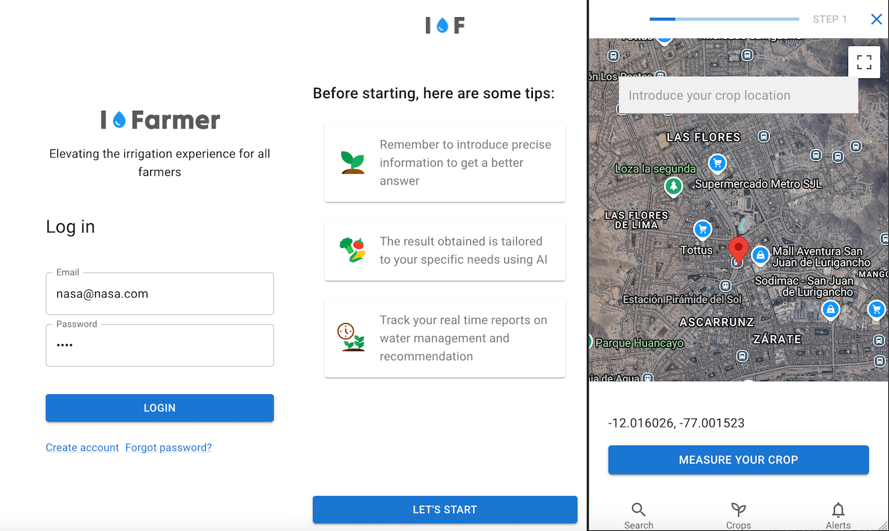

# ifarmer-nasa-hackaton-2024

## The challenge
Farmers face a deluge of water-related challenges due to unpredictable weather, pests, and diseases. These factors can significantly impact crop health, farmers’ profits, and food security. Depending upon the geography, many farmers may face droughts or floods—sometimes both of these extreme events occur within the same season! Your challenge is to design a tool that empowers farmers to easily explore, analyze, and utilize NASA datasets to address these water-related concerns and improve their farming practices.

https://www.spaceappschallenge.org/nasa-space-apps-2024/challenges/leveraging-earth-observation-data-for-informed-agricultural-decision-making/

## Our solution approach
**iFarmer** is a web app that allows anyone to view satellite images and select a specific area intended for cultivating food. After selecting the area, the user is prompted with a series of questions, which vary based on their previous responses. These questions include details such as the water source available for the crops, the amount of water required (in gallons, liters, or m³), the last irrigation date, the irrigation method used, and the type of crop (e.g., beans, potatoes, strawberries, etc.).

Once all this information is processed by our system, a customized report is generated, offering valuable insights that the farmer can use to take immediate action. For example:

- **Water Resource Management Score**: A simulation score based on Sustainability Indicators related to water usage.
- **Optimal Irrigation Schedule**: Recommendations on the best times to water crops, ensuring maximum water absorption by the plants and minimal water loss through evaporation.
- **Irrigation Method Suggestions**: Tailored recommendations on irrigation techniques best suited for the chosen area.
- **Nearby Alerts**: Notifications about potential external factors that may affect the crops.
- **Additional Crop Suggestions**: Recommendations for other types of crops that are well-suited for the selected area.


## Prerequisites
Create an account a request an api for:
- AI: https://openai.com/index/openai-api/
- Weather: https://www.meteomatics.com/en/sign-up-weather-api-test-account/
- Google Maps: https://developers.google.com/maps/

Next you're ready for configure the `.env` files

### Backend
`packages/api/.env`
| Environment   | Value         |
| ------------- | ------------- |
| MONGODB_URI  | mongodb+srv://user:pass-server  |
| OPENAI_API_KEY  | your key  |
| PORT  | Port 8080 or any other desired  |
| JWT_SECRET  | random secure string  |
| METEO_USERNAME  | meteomatics user  |
| METEO_PASSWORD  | meteomatics pass  |

### Frontend
`packages/front/.env`

| Environment   | Value         |
| ------------- | ------------- |
| VITE_GOOGLE_MAPS_API_KEY  | your api key  |
| VITE_API_URL  | the backend url  |


To install dependencies:

```bash
bun install
```

Ready to start?:

```bash
bun run index.ts
```

Check the rest API on swagger 

`http:your-url:port/swagger`

Open your url and port configured on the front `.env`

## Technologies

- Backend: https://elysiajs.com/ 
- Frontend: React https://es.react.dev/
- Runtime: Bun v1.1.24 https://bun.sh
- Build tool: Vite https://vite.dev/
- Database: MongoDb https://www.mongodb.com/es

## Create an test user
On mongodb create the User collection with the following register using compass: https://www.mongodb.com/products/tools/compass
```json
{
  "_id": {
    "$oid": "670191ab6442ce43056e9319"
  },
  "username": "nasa",
  "email": "nasa@nasa.com",
  "password": "$2b$04$nJarmBLnn4IagZ1WvgS.0uA6/JPmJaXqqsxnBYE74R665typjnxAO",
  "createdAt": {
    "$date": "2024-10-05T19:21:15.258Z"
  },
  "updatedAt": {
    "$date": "2024-10-05T19:21:15.258Z"
  },
  "__v": 0
}
```

